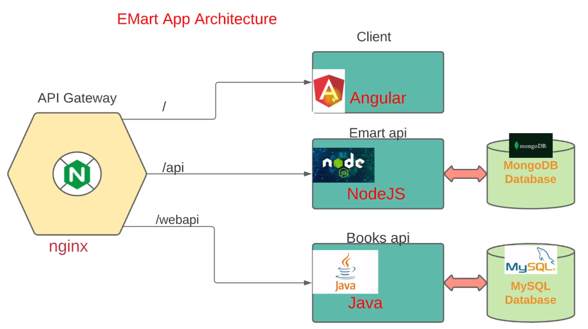
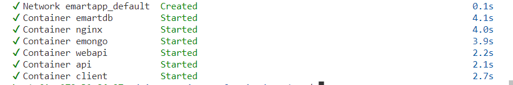
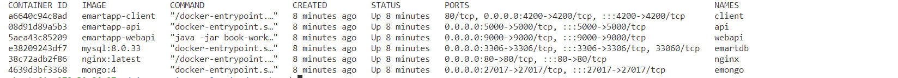
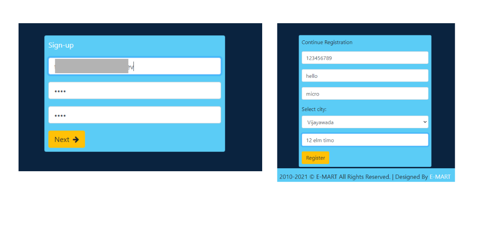

# emart-app




client: angular app hosted in nginx container
apigateway: nginx
webapi: jave hosted in jdk container
emartapi: nodejs hosted on a nodejs container


ec2 specifications:

* ubuntu 20.4
* t2.medium
* 15-20 GB Gp3
* SG with the following rules:
    * Allow SSH from your IP
    * Allow 80 from 0.0.0.0/0 Ipv4


## How to build?

```sh
https://github.com/colossus06/microservices-ec2-nginx.git
cd microservices-ec2-nginx/emartapp
```

Build the images. During this process, Docker Compose will look for the Dockerfiles defined in the build sections for each service(ANGULAR,node,java in this case) and executes the build steps specified in the file. 

```sh
docker compose build
```

Run them in the background:

```sh
docker compose up -d
```






## Validation

Get the public ip and visit the emart webapp



